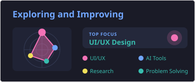

  

<h4>🎓 CSE Undergraduate | 🧑‍💻 Full Stack Developer | 🎨 UI/UX Design Enthusiast | 💡 Always learning and building.</h4>

## 🌐 Socials:

<h2>
  
  Tech Stack
</h2>

<table cellpadding="8">
  <tr>
    <th align="center" bgcolor="#002884">
      Languages &amp; Frameworks
    </th>
    <th align="center" bgcolor="#002884">
      Hosting &amp; Databases
    </th>
    <th align="center" bgcolor="#002884">
      Design
    </th>
    <th align="center" bgcolor="#002884">
      Testing
    </th>
  </tr>
  <tr>
    <td valign="top">
      &nbsp;
      &nbsp;
      &nbsp;
      &nbsp;
      &nbsp;
      &nbsp;
      &nbsp;
      &nbsp;
      &nbsp;
    </td>
    <td valign="top">
      &nbsp;
      &nbsp;
      &nbsp;
      &nbsp;
      &nbsp;
      &nbsp;
      &nbsp;
    </td>
    <td valign="top">
      &nbsp;
      &nbsp;
      &nbsp;
      &nbsp;
    </td>
    <td valign="top">
      &nbsp;
      &nbsp;
      &nbsp;
    </td>
  </tr>
</table>

## 📊 GitHub Stats

  
  

